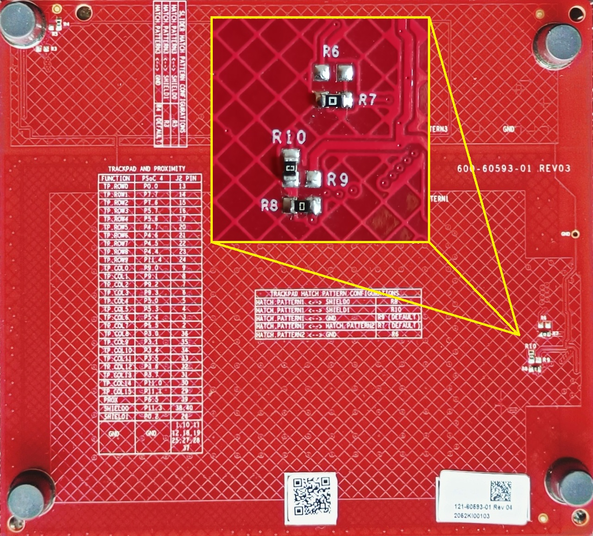
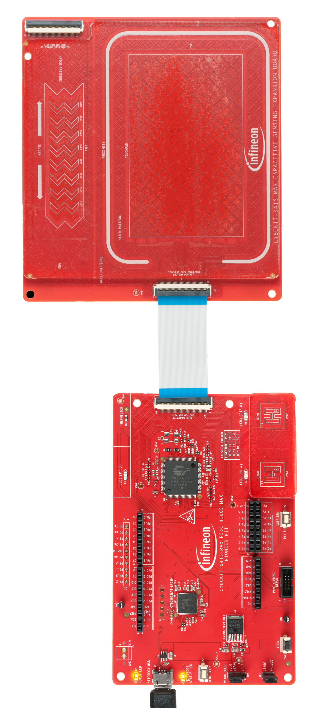
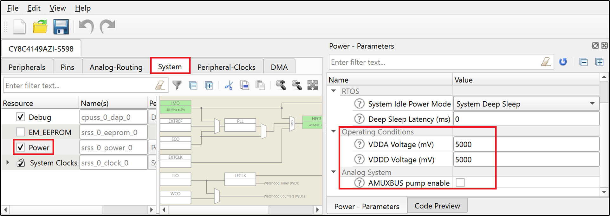

# PSoC&trade; 4 MCU CAPSENSE&trade; MSC Guard Sensor

*Disclaimer: This is a community code example (CCE) released for the benefit of the community users. These projects have only been tested for the listed BSPs, tools versions, and toolchains documented in this readme. They are intended to demonstrate how a solution / concept / use-case can be achieved on a particular device. For official code examples, please click [here](https://github.com/Infineon/Code-Examples-for-ModusToolbox-Software).*

This code example features the CAPSENSE&trade; guard sensor in PSoC&trade; 4 devices with Multi sense converter (MSC). The on-board LED will glow when touch is detected on trackpad but when the guard sensor is triggered due to liquid stream present on guard sensor surface, the on-board LED will stop glowing. The code example also demonstrates monitoring CAPSENSE&trade; data using the CAPSENSE&trade; Tuner GUI tool. This project uses the [CAPSENSE&trade; Middleware Library](https://github.com/Infineon/capsense).

## Requirements

- [ModusToolbox&trade; software](https://www.infineon.com/modustoolbox-software) v3.0

  **Note:** This code example version requires ModusToolbox&trade; software version 3.0 and may not be compatible with other versions.

- Board support package (BSP) minimum required version: 2.0.0
- Programming language: C
- Associated parts: [PSoC&trade; 4100S Max](https://www.infineon.com/CY8CKIT-041S-MAX)


## Supported toolchains (make variable 'TOOLCHAIN')

- GNU Arm&reg; embedded compiler v9.3.1 (`GCC_ARM`) - Default value of `TOOLCHAIN`

## Supported kits (make variable 'TARGET')

- [PSoC&trade; 4100S Max](https://www.infineon.com/CY8CKIT-041S-MAX) (`CY8CKIT-041S-MAX`) - Default value of `TARGET`

## Hardware setup

The "PROXIMITY" sensor on the *CY8CKIT-041S-MAX CAPACITIVE SENSING EXPANSION BOARD* is used as guard sensor and driven shield is used in this code example. Soldering re-work is required on the *CY8CKIT-041S-MAX CAPACITIVE SENSING EXPANSION BOARD* as shown in **Figure 1**. This ensures HATCH_PATTERN1 AND HATCH_PATTERN2 are driven by shield signal. Resistor R8 needs to be populated for SHIELD0 connection and resistor R10 for SHIELD1 connection. Resistor R7, which connects HATCH_PATTERN1 AND HATCH_PATTERN2 (the hatches driven by SHIELD0 and SHIELD1 respectively), is left as it is.

**Figure 1. Kit re-work done on the CY8CKIT-041S-MAX CAPACITIVE SENSING EXPANSION BOARD**

   


See the [Kit user guide](https://www.infineon.com/dgdl/Infineon-CY8CKIT-041S-MAX_PSoC_4100S_Max_Pioneer_Kit_Guide-UserManual-v01_00-EN.pdf?fileId=8ac78c8c7d710014017d71538d1f209d&utm_source=cypress&utm_medium=referral&utm_campaign=202110_globe_en_all_integration-files) to ensure that the board is configured correctly to VDDA at 5V (J10 should be at position 1 and 2). If you are using the code example at a VDDA voltage other than 5 V, ensure to set up the device power voltages correctly for the proper operation of the device power domains.  See [Steps to setup the VDDA supply voltage in device configurator](#steps-to-setup-the-vdda-supply-voltage-in-device-configurator) for more details.

## Software setup

This example requires no additional software or tools.

## Using the code example

Create the project and open it using one of the following:

<details><summary><b>In Eclipse IDE for ModusToolbox&trade; software</b></summary>

1. Click the **New Application** link in the **Quick Panel** (or, use **File** > **New** > **ModusToolbox Application**). This launches the [Project Creator](https://www.infineon.com/dgdl/Infineon-ModusToolbox_Project_Creator_Guide_3-UserManual-v01_00-EN.pdf?fileId=8ac78c8c7d718a49017d99bcabbd31e5) tool.

2. Pick a kit supported by the code example from the list shown in the **Project Creator - Choose Board Support Package (BSP)** dialog.

   When you select a supported kit, the example is reconfigured automatically to work with the kit. To work with a different supported kit later, use the [Library Manager](https://www.infineon.com/dgdl/Infineon-ModusToolbox_Library_Manager_User_Guide_3-UserManual-v01_00-EN.pdf?fileId=8ac78c8c7d718a49017d99ab34b831ce) to choose the BSP for the supported kit. You can use the Library Manager to select or update the BSP and firmware libraries used in this application. To access the Library Manager, click the link from the **Quick Panel**.

   You can also just start the application creation process again and select a different kit.

   If you want to use the application for a kit not listed here, you may need to update the source files. If the kit does not have the required resources, the application may not work.

3. In the **Project Creator - Select Application** dialog, choose the example by enabling the checkbox.

4. (Optional) Change the suggested **New Application Name**.

5. The **Application(s) Root Path** defaults to the Eclipse workspace which is usually the desired location for the application. If you want to store the application in a different location, you can change the *Application(s) Root Path* value. Applications that share libraries should be in the same root path.

6. Click **Create** to complete the application creation process.

For more details, see the [Eclipse IDE for ModusToolbox&trade; software user guide](https://www.infineon.com/dgdl/Infineon-ModusToolbox_2.4_User_Guide-UserManual-v01_00-EN.pdf?fileId=8ac78c8c7e7124d1017ed97e72563632) (locally available at *{ModusToolbox&trade; software install directory}/ide_{version}/docs/mt_ide_user_guide.pdf*).

</details>

<details><summary><b>In command-line interface (CLI)</b></summary>

ModusToolbox&trade; software provides the Project Creator as both a GUI tool and the command line tool, "project-creator-cli". The CLI tool can be used to create applications from a CLI terminal or from within batch files or shell scripts. This tool is available in the *{ModusToolbox&trade; software install directory}/tools_{version}/project-creator/* directory.

Use a CLI terminal to invoke the "project-creator-cli" tool. On Windows, use the command line "modus-shell" program provided in the ModusToolbox&trade; software installation instead of a standard Windows command-line application. This shell provides access to all ModusToolbox&trade; software tools. You can access it by typing `modus-shell` in the search box in the Windows menu. In Linux and macOS, you can use any terminal application.

This tool has the following arguments:

Argument | Description | Required/optional
---------|-------------|-----------
`--board-id` | Defined in the `<id>` field of the [BSP](https://github.com/Infineon?q=bsp-manifest&type=&language=&sort=) manifest | Required
`--app-id`   | Defined in the `<id>` field of the [CE](https://github.com/Infineon?q=ce-manifest&type=&language=&sort=) manifest | Required
`--target-dir`| Specify the directory in which the application is to be created if you prefer not to use the default current working directory | Optional
`--user-app-name`| Specify the name of the application if you prefer to have a name other than the example's default name | Optional

<br>

The following example will clone the "[CAPSENSE&trade; MSC Guard Sensor](https://github.com/Infineon/cce-mtb-psoc4-msc-capsense-guard)" application with the desired name "MyCapsenseGuard" configured for the *CY8CKIT-041S-MAX* BSP into the specified working directory, *C:/mtb_projects*:

   ```
   project-creator-cli --board-id CY8CKIT-041S-MAX --app-id cce-mtb-psoc4-msc-capsense-guard --user-app-name MyCapsenseGuard --target-dir "C:/mtb_projects"
   ```

**Note:** The project-creator-cli tool uses the `git clone` and `make getlibs` commands to fetch the repository and import the required libraries. For details, see the "Project creator tools" section of the [ModusToolbox&trade; software user guide](https://www.infineon.com/dgdl/Infineon-ModusToolbox_2.4_User_Guide-UserManual-v01_00-EN.pdf?fileId=8ac78c8c7e7124d1017ed97e72563632) (locally available at *{ModusToolbox&trade; software install directory}/docs_{version}/mtb_user_guide.pdf*).

</details>

<details><summary><b>In third-party IDEs</b></summary>

Use one of the following options:

- **Use the standalone [Project Creator](https://www.infineon.com/dgdl/Infineon-ModusToolbox_Project_Creator_Guide_3-UserManual-v01_00-EN.pdf?fileId=8ac78c8c7d718a49017d99bcabbd31e5) tool:**

   1. Launch Project Creator from the Windows Start menu or from *{ModusToolbox&trade; software install directory}/tools_{version}/project-creator/project-creator.exe*.

   2. In the initial **Choose Board Support Package** screen, select the BSP, and click **Next**.

   3. In the **Select Application** screen, select the appropriate IDE from the **Target IDE** drop-down menu.

   4. Click **Create** and follow the instructions printed in the bottom pane to import or open the exported project in the respective IDE.

<br>

- **Use command-line interface (CLI):**

   1. Follow the instructions from the **In command-line interface (CLI)** section to create the application, and then import the libraries using the `make getlibs` command.

   2. Export the application to a supported IDE using the `make <ide>` command.

   3. Follow the instructions displayed in the terminal to create or import the application as an IDE project.

For a list of supported IDEs and more details, see the "Exporting to IDEs" section of the [ModusToolbox&trade; software user guide](https://www.infineon.com/dgdl/Infineon-ModusToolbox_2.4_User_Guide-UserManual-v01_00-EN.pdf?fileId=8ac78c8c7e7124d1017ed97e72563632) (locally available at *{ModusToolbox&trade; software install directory}/docs_{version}/mtb_user_guide.pdf*).

</details>


## Operation

1. Connect the FFC cable between J9 on PSoC&trade; 4100S Max pioneer board and J2 on a capacitive sensing expansion board. Power the device by plugging a USB 2.0 Type A to Micro-B cable on J8 (USB Micro-B connector). The connection are shown in **Figure 2**.
     

   **Figure 2. Connecting the CY8CKIT-041S-MAX kit with capacitive sensing expansion board to a PC**

   

2. Program the board using one of the following:

   <details><summary><b>Using Eclipse IDE for ModusToolbox&trade; software</b></summary>

      1. Select the application project in the Project Explorer.

      2. In the **Quick Panel**, scroll down, and click **\<Application Name> Program (KitProg3_MiniProg4)**.
   </details>

   <details><summary><b>Using CLI</b></summary>

     From the terminal, execute the `make program` command to build and program the application using the default toolchain to the default target. The default toolchain and target are specified in the application's Makefile but you can override those values manually:
      ```
      make program TARGET=<BSP> TOOLCHAIN=<toolchain>
      ```

      Example:
      ```
      make program TARGET=CY8CKIT-041S-MAX TOOLCHAIN=GCC_ARM
      ```

   </details>

3. After programming, the application starts automatically. 

4. To test the application, slide your finger over the CAPSENSE&trade; touchpad and notice that the user LED turns ON when touched and turns OFF when the finger is lifted.

5. In case there is stream of liquid present on the Capacitive sensing expansion board such that the guard sensor is shorted to GND (HATCH_PATTERN3), the guard sensor will be triggered and the on-board LED will stop glowing. The LED will remain off until guard senor is active i.e. liquid stream is present on top of the guard sensor.

6. You can also monitor the CAPSENSE&trade; data using the CAPSENSE&trade; Tuner application as follows:

    **Monitor Data Using CAPSENSE&trade; Tuner**

    1. Open CAPSENSE&trade; Tuner from the IDE Quick Panel. 
    
        You can also run the CAPSENSE&trade; Tuner application standalone from *{ModusToolbox install directory}/ModusToolbox/tools_{version}/capsense-configurator/capsense-tuner*. In this case, after opening the application, select **File** > **Open** and open the *design.cycapsense* file for the respective kit, which is present in the *TARGET_\<BSP-NAME>/{version}/COMPONENT_BSP_DESIGN_MODUS* or *COMPONENT_CUSTOM_DESIGN_MODUS* folder. 

    3. Ensure the kit is in KitProg3 mode. See [Firmware-loader](https://github.com/Infineon/Firmware-loader) to learn on how to update the firmware and switch to KitProg3 mode.

    4. In the Tuner application, click **Tuner Communication Setup** or select **Tools** > **Tuner Communication Setup**. In the window that appears, select the I2C checkbox under KitProg3 and configure as follows: 

            I2C Address: 8
            Sub-address: 2-Bytes
            Speed (kHz): 1000

    5. Click **Connect** or select **Communication** > **Connect**.

    6. Click **Start** or select **Communication** > **Start**.

    Under the **Widget View** tab, you can see the prximity widget highlighted in blue color when active. You can also view the sensor data in the **Graph View** tab. 

    The CAPSENSE&trade; Tuner can also be used for CAPSENSE&trade; parameter tuning, and measuring signal-to-noise ratio (SNR). See the [ModusToolbox&trade; CAPSENSE&trade; Tuner Guide](https://www.infineon.com/dgdl/Infineon-ModusToolbox_CAPSENSE_Tuner_Guide_4-UserManual-v01_00-EN.pdf?fileId=8ac78c8c7d718a49017d99ab0fda31c5) (**Help** > **View Help**) and [AN85951 – PSoC 4 and PSoC 6 MCU CAPSENSE&trade; Design Guide](https://www.infineon.com/AN85951) for more details on selecting the tuning parameters. 


## Debugging

You can debug the example to step through the code. In the IDE, use the **\<Application Name> Debug (KitProg3_MiniProg4)** configuration in the **Quick Panel**. For details, see the "Program and debug" section in the [Eclipse IDE for ModusToolbox&trade; software user guide](https://www.infineon.com/dgdl/Infineon-ModusToolbox_2.4_User_Guide-UserManual-v01_00-EN.pdf?fileId=8ac78c8c7e7124d1017ed97e72563632).

## Design and implementation

The design has a ratiometric self-capacitance (CSD-RM) based, 26-element (10+16) CAPSENSE™ touchpad and one ratiometric self-capacitance (CSD-RM) based CAPSENSE&trade; guard sensor. Driven shield is configured and the hatches (HATCH_PATTERN1 and HATCH_PATTERN2) present around the guard sensor and touchpad are driven by this signal.
 
The project uses the [CAPSENSE&trade; middleware](https://github.com/Infineon/capsense) (see ModusToolbox&trade; user guide for more details on selecting a middleware). See [AN85951 – PSoC&trade; 4 and PSoC&trade; 6 MCU CAPSENSE&trade; design guide](https://www.infineon.com/AN85951) for more details on CAPSENSE&trade; features and usage.

The [ModusToolbox&trade; software](https://www.infineon.com/modustoolbox-software) provides a GUI-based tuner application for debugging and tuning the CAPSENSE&trade; system. The *CAPSENSE&trade; tuner* application works with EZI2C and UART communication interfaces. This project has an SCB block configured in EZI2C mode to establish communication with the on-board KitProg, which in turn enables reading the CAPSENSE&trade; raw data by the CAPSENSE&trade; tuner. The proximity sensor may be tuned using CAPSENSE&trade; tuner. Once tuned, the new parameters may be applied to project. See [ModusToolbox&trade; CAPSENSE&trade; Tuner Guide](https://www.infineon.com/dgdl/Infineon-ModusToolbox_CAPSENSE_Tuner_Guide_4-UserManual-v01_00-EN.pdf?fileId=8ac78c8c7d718a49017d99ab0fda31c5) for more details.

Slide your finger over the CAPSENSE&trade; touchpad and notice that the user LED turns ON when touched and turns OFF when the finger is lifted. If guard sensor is active due to stream of liquid present on top of it, the LED will stop glowing.

### Steps to setup the VDDA supply voltage in device configurator

1. Open Device configurator from the Quick panel. 

2. Go to the **System** tab. Select the **Power** resource, and set the set the VDDA value under **Operating conditions** as shown in **Figure 3**. 

   **Figure 3. Setting the VDDA supply in system tab of device configurator**

    

**Note**: [PSoC&trade; 4100S Max pioneer kit](https://www.infineon.com/CY8CKIT-041S-MAX) has two onboard regulators 3.3V and 5V. To use 3.3V, place the jumper J10 at positions 2 and 3. See the Kit user guide for more details.


### Resources and settings

**Figure 4: EZI2C Settings**

   

**Table 1. Application resources**

| Resource  |  Alias/object     |    Purpose     |
| :------- | :------------    | :------------ |
| SCB (I2C) (PDL) | CYBSP_EZI2C | EZI2C slave driver to communicate with the CAPSENSE&trade; tuner |
| CAPSENSE&trade; | CYBSP_MSC0, CYBSP_MSC1 | CAPSENSE&trade; driver to interact with CAPSENSE&trade; hardware and interface CAPSENSE&trade; sensors |
| Digital Pins | CYBSP_USER_LED | To visually indicate the presence of a hand on top of the CAPSENSE&trade; trackpad |


**Table 2. Pins used for CAPSENSE&trade; sensors and LEDs**

| Development kit | Guard sensor | Driven shield | LED | Touchpad |
| :-------------- | :--------------- | :------------ | :--- | :-------- |
| CY8CKIT-041S-MAX | P6[5] | P11[3] <br> P0[2] | P7[3] | P0[0], P7[7], P7[6], P5[7] <br> P5[6], P4[7], P4[6], P4[5] <br> P4[4], P11[4], P9[0], P9[1] <br> P9[2], P9[3], P5[0], P5[3] <br> P5[4], P5[5], P3[0], P3[1] <br> P3[4], P3[5], P3[6], P3[7] <br> P11[0], P11[1]  

<br>

## Related resources

Resources  | Links
-----------|----------------------------------
Application notes  | [AN79953](https://www.infineon.com/AN79953) – Getting started with PSoC&trade; 4 <br>  [AN85951](https://www.infineon.com/AN85951) – PSoC&trade; 4 and PSoC&trade; 6 MCU CAPSENSE&trade; design guide
Code examples  | [Using ModusToolbox&trade; software](https://github.com/Infineon/Code-Examples-for-ModusToolbox-Software) on GitHub
Device documentation | [PSoC&trade; 4100S Max pioneer kit guide](https://www.infineon.com/dgdl/Infineon-CY8CKIT-041S-MAX_PSoC_4100S_Max_Pioneer_Kit_Guide-UserManual-v01_00-EN.pdf?fileId=8ac78c8c7d710014017d71538d1f209d) <br> 
Development kits | Visit [PSoC&trade; and FMx MCU Board & Kit Finder](https://www.infineon.com/cms/en/design-support/finder-selection-tools/product-finder/PSoC-FMx-MCU-board/) to find a list of various PSoC&trade; evaluation boards.
Libraries on GitHub  | [mtb-pdl-cat2](https://github.com/Infineon/mtb-pdl-cat2) – PSoC&trade; 4 peripheral driver library (PDL) <br>  [mtb-hal-cat2](https://github.com/Infineon/mtb-hal-cat2) – Hardware abstraction layer (HAL) library
Middleware on GitHub  | [capsense](https://github.com/Infineon/capsense) – CAPSENSE&trade; library and documents <br> [psoc4-middleware](https://github.com/Infineon/modustoolbox-software#psoc-4--pmg-base-libraries) – Links to all PSoC&trade; 4 MCU middleware
Tools  | [Eclipse IDE for ModusToolbox&trade; software](https://www.infineon.com/modustoolbox) – ModusToolbox&trade; software is a collection of easy-to-use software and tools enabling rapid development with Infineon MCUs, covering applications from embedded sense and control to wireless and cloud-connected systems using AIROC&trade; Wi-Fi and Bluetooth&reg; connectivity devices.

<br>

## Other resources

Infineon provides a wealth of data at www.infineon.com to help you select the right device, and quickly and effectively integrate it into your design.

## Document history

Document title: *CCE236299 - PSoC&trade; 4 MCU: CAPSENSE&trade; MSC Guard Sensor*

| Version | Description of change      |
| ------- | ---------------------      |
| 1.0.0   | New community code example |

<br>

---------------------------------------------------------


© Cypress Semiconductor Corporation, 2016-2021. This document is the property of Cypress Semiconductor Corporation, an Infineon Technologies company, and its affiliates (“Cypress”). This document, including any software or firmware included or referenced in this document (“Software”), is owned by Cypress under the intellectual property laws and treaties of the United States and other countries worldwide. Cypress reserves all rights under such laws and treaties and does not, except as specifically stated in this paragraph, grant any license under its patents, copyrights, trademarks, or other intellectual property rights. If the Software is not accompanied by a license agreement and you do not otherwise have a written agreement with Cypress governing the use of the Software, then Cypress hereby grants you a personal, non-exclusive, nontransferable license (without the right to sublicense) (1) under its copyright rights in the Software (a) for Software provided in source code form, to modify and reproduce the Software solely for use with Cypress hardware products, only internally within your organization, and (b) to distribute the Software in binary code form externally to end users (either directly or indirectly through resellers and distributors), solely for use on Cypress hardware product units, and (2) under those claims of Cypress’s patents that are infringed by the Software (as provided by Cypress, unmodified) to make, use, distribute, and import the Software solely for use with Cypress hardware products. Any other use, reproduction, modification, translation, or compilation of the Software is prohibited.
<br>

TO THE EXTENT PERMITTED BY APPLICABLE LAW, CYPRESS MAKES NO WARRANTY OF ANY KIND, EXPRESS OR IMPLIED, WITH REGARD TO THIS DOCUMENT OR ANY SOFTWARE OR ACCOMPANYING HARDWARE, INCLUDING, BUT NOT LIMITED TO, THE IMPLIED WARRANTIES OF MERCHANTABILITY AND FITNESS FOR A PARTICULAR PURPOSE. No computing device can be absolutely secure. Therefore, despite security measures implemented in Cypress hardware or software products, Cypress shall have no liability arising out of any security breach, such as unauthorized access to or use of a Cypress product. CYPRESS DOES NOT REPRESENT, WARRANT, OR GUARANTEE THAT CYPRESS PRODUCTS, OR SYSTEMS CREATED USING CYPRESS PRODUCTS, WILL BE FREE FROM CORRUPTION, ATTACK, VIRUSES, INTERFERENCE, HACKING, DATA LOSS OR THEFT, OR OTHER SECURITY INTRUSION (collectively, “Security Breach”). Cypress disclaims any liability relating to any Security Breach, and you shall and hereby do release Cypress from any claim, damage, or other liability arising from any Security Breach. In addition, the products described in these materials may contain design defects or errors known as errata which may cause the product to deviate from published specifications. To the extent permitted by applicable law, Cypress reserves the right to make changes to this document without further notice. Cypress does not assume any liability arising out of the application or use of any product or circuit described in this document. Any information provided in this document, including any sample design information or programming code, is provided only for reference purposes. It is the responsibility of the user of this document to properly design, program, and test the functionality and safety of any application made of this information and any resulting product. “High-Risk Device” means any device or system whose failure could cause personal injury, death, or property damage. Examples of High-Risk Devices are weapons, nuclear installations, surgical implants, and other medical devices. “Critical Component” means any component of a High-Risk Device whose failure to perform can be reasonably expected to cause, directly or indirectly, the failure of the High-Risk Device, or to affect its safety or effectiveness. Cypress is not liable, in whole or in part, and you shall and hereby do release Cypress from any claim, damage, or other liability arising from any use of a Cypress product as a Critical Component in a High-Risk Device. You shall indemnify and hold Cypress, including its affiliates, and its directors, officers, employees, agents, distributors, and assigns harmless from and against all claims, costs, damages, and expenses, arising out of any claim, including claims for product liability, personal injury or death, or property damage arising from any use of a Cypress product as a Critical Component in a High-Risk Device. Cypress products are not intended or authorized for use as a Critical Component in any High-Risk Device except to the limited extent that (i) Cypress’s published data sheet for the product explicitly states Cypress has qualified the product for use in a specific High-Risk Device, or (ii) Cypress has given you advance written authorization to use the product as a Critical Component in the specific High-Risk Device and you have signed a separate indemnification agreement.
<br>

Cypress, the Cypress logo, and combinations thereof, PSoC, CapSense, EZ-USB, F-RAM, Traveo, WICED, and ModusToolbox are trademarks or registered trademarks of Cypress or a subsidiary of Cypress in the United States or in other countries. For a more complete list of Cypress trademarks, visit cypress.com. Other names and brands may be claimed as property of their respective owners.
